# RUNG Extensions: Improving Robust Graph Neural Networks via Unbiased Aggregation

This repository builds on the NeurIPS 2024 paper **[Robust Graph Neural Networks via Unbiased Aggregation (RUNG)](https://arxiv.org/abs/2311.14934)** and explores new methods to improve RUNG’s clean accuracy and adversarial robustness.

<p align="center">
  
</p>

**Base paper:** Zhichao Hou, Ruiqi Feng, Tyler Derr, Xiaorui Liu — *Robust Graph Neural Networks via Unbiased Aggregation*, NeurIPS 2024 ([arXiv:2311.14934](https://arxiv.org/abs/2311.14934)).

**This project’s focus:** adaptive / learnable / parametric / percentile γ schedules, cosine and learnable edge distances, combined models, homophily-aware pruning, confidence-weighted skip connections, adversarial training, and cosine-aware attack evaluation.

---

## Table of Contents

1. [Overview](#overview)
2. [Repository Structure](#repository-structure)
3. [Method Zoo](#method-zoo)
4. [Installation](#installation)
5. [Quick Start](#quick-start)
6. [Datasets](#datasets)
7. [Training & Evaluation](#training--evaluation)
8. [Hyperparameters](#hyperparameters)
9. [Experimental Protocol](#experimental-protocol)
10. [Results & Figures](#results--figures)
11. [Documentation Map](#documentation-map)
12. [Citation](#citation)

---

## Overview

### What is RUNG?

RUNG is a **decoupled** robust GNN:

1. An **MLP** maps node features \(X\) to class-space features \(F^0\).
2. **QN-IRLS** propagation (typically \(K=10\) steps) minimizes the RUGE objective:

\[
H(F)=\sum_{(i,j)\in E}\rho_\gamma\!\left(\Big\|\frac{f_i}{\sqrt{d_i}}-\frac{f_j}{\sqrt{d_j}}\Big\|\right)
+\lambda\sum_i\|f_i-f_i^0\|^2
\]

3. Nonconvex penalties (**MCP** / **SCAD**) downweight or prune edges with large feature differences, reducing estimation bias under adversarial edge flips.

Default paper setting used as baseline here: **MCP**, fixed \(\gamma=6.0\), Euclidean edge distance.

### What this repo adds

Fixed \(\gamma\) and Euclidean distance leave several failure modes:

| Problem | Consequence | Extension in this repo |
|---------|-------------|------------------------|
| Fixed \(\gamma\) too large at deep layers | Features shrink; pruning stops near the output | Percentile / parametric / learnable \(\gamma\) |
| Euclidean \(y_{ij}\) is scale-sensitive | Attackers can hide by matching norms | Cosine / projection / bilinear distance |
| One global threshold | Heterophilic graphs over-prune valid edges | Homophily-adaptive per-node \(q_i\) |
| Uniform skip \(\lambda\) | Uncertain nodes under-protected | Confidence-weighted \(\lambda\) |
| Clean-only training | Weak under strong PGD | Adversarial training (V1 / V2) |
| Standard PGD only | Underestimates cosine defenses | Cosine-stealth adaptive attack |

---

## Repository Structure

```
RUNG_ML_Project/
├── clean.py                 # Train models (clean accuracy)
├── attack.py                # Standard PGD evasion attack
├── cosine_attack.py         # Cosine-stealth adaptive PGD
├── run_all.py               # Batch train + attack orchestrator
├── plot_logs.py             # Parse log/ → figures/
├── utils.py                 # Shared helpers (norm, accuracy, log IDs)
├── load_graph.py            # Alternate loaders (legacy)
├── requirements.txt
├── environment.yml
│
├── model/                   # RUNG + all variants + baselines
│   ├── rung.py              # Base RUNG (NeurIPS 2024)
│   ├── rung_learnable_gamma.py
│   ├── rung_parametric_gamma.py
│   ├── rung_percentile_gamma.py
│   ├── rung_learnable_distance.py
│   ├── rung_combined.py
│   ├── rung_combined_model.py
│   ├── rung_learnable_combined.py
│   ├── rung_homophily_adaptive.py
│   ├── rung_confidence_lambda.py
│   ├── att_func.py / rho.py / penalty.py
│   └── gcn.py / gat.py / mlp.py / softmedian.py
│
├── train_eval_data/         # Dataset loading + per-variant trainers
│   ├── get_dataset.py
│   ├── fit.py               # Base RUNG trainer
│   ├── fit_*.py             # Variant-specific fitters
│   └── adversarial_trainer.py
│
├── exp/
│   ├── config/get_model.py  # Central model factory
│   ├── models/              # Saved checkpoints
│   └── results/             # Experiment reports
│
├── experiments/             # Ablations, compare, percentile search, plots
├── gb/                      # Graph-benchmark attacks, metrics, CUDA kernels
├── data/                    # cora.npz, citeseer.npz; caches for others
├── log/                     # Per-dataset clean / attack / cosine_attack logs
├── figures/                 # Paper + generated robustness plots
└── docs/
    ├── changes/             # Design notes for each extension (000–018)
    ├── model_codeflow/      # Diffs vs base RUNG
    └── otherfiles/          # Guides, tests, original paper README
```

---

## Method Zoo

### Lineage

```
RUNG (MCP/SCAD, fixed γ, Euclidean)
 ├─ RUNG_new (+ PenaltyFunction: SCAD / L1 / L2 / ADAPTIVE)
 ├─ RUNG_learnable_gamma          — per-layer learnable γ
 │    ├─ RUNG_parametric_gamma    — γ^(k) = γ₀ · r^k  (2 params)
 │    ├─ RUNG_percentile_gamma    — γ^(k) = quantile(y, q)
 │    │    ├─ RUNG_learnable_distance   — cosine / projection / bilinear y_ij
 │    │    │    ├─ RUNG_combined              — percentile γ + cosine
 │    │    │    ├─ RUNG_learnable_combined    — cosine + learnable γ ∈ (0,2)
 │    │    │    └─ RUNG_homophily_adaptive    — per-node adaptive q_i
 │    │    └─ RUNG_combined_model  — cosine + blend(parametric, percentile)
 │    └─ RUNG_confidence_lambda   — per-node λ from prediction confidence
 └─ RUNG_percentile_adv / _v2, RUNG_parametric_adv
```

### Variant summary

| Model | Core idea | Key knobs |
|-------|-----------|-----------|
| **RUNG** | Paper baseline: fixed MCP/SCAD γ, Euclidean | `--norm MCP --gamma 6.0` |
| **RUNG_learnable_gamma** | One learnable γ per propagation layer | `--gamma_init_strategy`, `--gamma_lr_factor` |
| **RUNG_parametric_gamma** | Geometric schedule \(\gamma^{(k)}=\gamma_0 r^k\) | `--decay_rate_init 0.85` |
| **RUNG_percentile_gamma** | Data-driven \(\gamma^{(k)}=\mathrm{quantile}(y,q)\) | `--percentile_q 0.75` |
| **RUNG_learnable_distance** | Replace Euclidean with cosine (or learned) distance | `--distance_mode cosine` |
| **RUNG_combined** | Percentile γ + cosine distance | `--percentile_q 0.75` |
| **RUNG_combined_model** | Cosine + learnable blend of parametric & percentile γ | `--alpha_blend_init 0.5` |
| **RUNG_learnable_combined** | Cosine + learnable γ in \((0,2)\) | `--gamma_mode per_layer\|schedule` |
| **RUNG_homophily_adaptive** | Per-node \(q_i = q + (1-h_i)\,q_{\mathrm{relax}}\) | `--q_relax 0.20` |
| **RUNG_confidence_lambda** | Confidence-weighted skip λ | `--confidence_mode`, `--warmup_epochs` |
| **RUNG_percentile_adv(_v2)** | Percentile RUNG + PGD adversarial training | `--adv_alpha`, curriculum |
| **RUNG_parametric_adv** | Parametric RUNG + adversarial training | same as above |

**Baselines also available:** `GCN`, `GAT`, `APPNP` (L2 RUNG), `L1`, `MLP` (`prop_step=0`), SoftMedian (under `gb/` / `model/`).

### Combined model (recommended stack)

`RUNG_combined_model` integrates three complementary ideas:

\[
\gamma^{(k)}=\sigma(\alpha)\,\gamma_{\mathrm{param}}^{(k)}+\bigl(1-\sigma(\alpha)\bigr)\,\gamma_{\mathrm{data}}^{(k)}
\]

- \(\gamma_{\mathrm{param}}^{(k)}=\gamma_0\cdot r^k\) — smooth learned schedule  
- \(\gamma_{\mathrm{data}}^{(k)}=\mathrm{quantile}(y_{\mathrm{edges}},q)\) — data-driven  
- Cosine \(y_{ij}\) — scale-invariant edge suspiciousness in \([0,2]\)

Only **3 extra scalars** vs base RUNG: `log_gamma_0`, `raw_decay`, `raw_alpha_blend`.

---

## Installation

Python **3.10** is recommended.

### Option A — pip

```bash
conda create -n rung python=3.10
conda activate rung
pip install -r requirements.txt
```

For heterophilic / OGB datasets and geometric ops:

```bash
pip install torch-geometric ogb
# Install torch-scatter / torch-sparse matching your PyTorch + CUDA build
```

### Option B — conda env file

```bash
conda env create -f environment.yml
conda activate rung_wsl
```

> **GPU note:** Training uses CUDA when available. Modern PyTorch builds typically need compute capability **≥ 7.0**. On older GPUs, force CPU with `CUDA_VISIBLE_DEVICES=` or `--device cpu` where supported.

---

## Quick Start

### 1. Train base RUNG (paper setting)

```bash
python clean.py --model='RUNG' --norm='MCP' --gamma=6.0 --data='cora'
```

### 2. Evaluate under PGD edge-flip attack

```bash
python attack.py --model='RUNG' --norm='MCP' --gamma=6.0 --data='cora'
```

### 3. Train an extension

```bash
# Percentile gamma
python clean.py --model RUNG_percentile_gamma --data cora --percentile_q 0.75

# Cosine distance + percentile gamma
python clean.py --model RUNG_learnable_distance --distance_mode cosine --percentile_q 0.75 --data cora

# Full combined model
python clean.py --model RUNG_combined_model --data cora \
  --percentile_q 0.75 --decay_rate_init 0.85 --alpha_blend_init 0.5

# Heterophilic graphs
python clean.py --model RUNG_homophily_adaptive --data chameleon --q_relax 0.20
```

### 4. Batch experiments + plots

```bash
python run_all.py \
  --datasets cora citeseer pubmed \
  --models RUNG RUNG_percentile_gamma RUNG_learnable_distance RUNG_combined_model

python plot_logs.py --log_dir log --out_dir figures
```

Logs land in `log/<dataset>/clean/` and `log/<dataset>/attack/`. Figures go to `figures/attack/` and `figures/attack_comparison/`.

---

## Datasets

Loaded via `train_eval_data/get_dataset.py`.

| Dataset | Type | Homophily (approx.) | Source |
|---------|------|---------------------|--------|
| **cora** | Citation | ~0.81 | Bundled `data/cora.npz` |
| **citeseer** | Citation | ~0.74 | Bundled `data/citeseer.npz` |
| **pubmed** | Citation | ~0.80 | Auto-download (Planetoid) → `data/pubmed/` |
| **chameleon**, **squirrel** | Wikipedia | ~0.23 / ~0.22 | torch_geometric |
| **cornell**, **texas**, **wisconsin**, **actor** | WebKB / Actor | ~0.11–0.22 | torch_geometric |
| **ogbn-arxiv**, **ogbn-products**, … | OGB | — | `ogb` → `data/ogb/` |

**Splits:** 5 deterministic splits with **10% / 10% / 80%** train / val / test (`random_state` 0…4). Each run reports mean ± std over these splits (and typically 5 seeds in batch scripts).

---

## Training & Evaluation

### Entry points

| Script | Role |
|--------|------|
| `clean.py` | Train; dispatches to the correct `fit_*` trainer |
| `attack.py` | Load saved models; PGD over attack budgets |
| `cosine_attack.py` | PGD + cosine stealth: \(L = L_{\mathrm{margin}} + \beta\cdot\mathrm{mean\_cosine}(\mathrm{added\ edges})\) |
| `run_all.py` | Orchestrate train / attack / optional cosine attack across models & datasets |
| `plot_logs.py` | Build robustness curves and clean-accuracy bars from logs |

### `run_all.py` examples

```bash
# Core comparison
python run_all.py --datasets cora citeseer pubmed \
  --models RUNG RUNG_percentile_gamma RUNG_learnable_distance RUNG_combined_model

# Train only
python run_all.py --datasets cora --models RUNG --skip_attack

# Attack only (reuse checkpoints)
python run_all.py --datasets cora --models RUNG --skip_clean

# Include cosine adaptive attack
python run_all.py --datasets cora --models RUNG_combined_model --cosine-attack --beta 1.0
```

Default attack budgets in `run_all.py` include  
`0.05, 0.10, …, 1.00` (fraction of edges flipped). `attack.py` defaults to  
`0.05 0.1 0.2 0.3 0.4 0.6`.

### Artifacts

| Path | Contents |
|------|----------|
| `exp/models/<dataset>/` | Saved model checkpoints |
| `log/<dataset>/clean/` | Clean training logs |
| `log/<dataset>/attack/` | PGD attack logs |
| `log/<dataset>/cosine_attack/` | Cosine-stealth attack logs |
| `figures/` | Generated and paper figures |

---

## Hyperparameters

### Shared defaults

| Parameter | Default | Notes |
|-----------|---------|-------|
| MLP hidden | `[64]` | Dropout `0.5` |
| `lam_hat` | `0.9` | \(\lambda = 1/\hat\lambda - 1\) |
| `prop_step` | `10` | QN-IRLS layers |
| Optimizer | Adam | `lr=0.05`, `weight_decay=5e-4` |
| Epochs | `300` | Early stopping common in variant trainers |
| Penalty | MCP | `--gamma 6.0` for base RUNG |

### Variant-specific CLI

| Variant | Important args |
|---------|----------------|
| learnable_gamma | `--gamma_init_strategy {uniform,decreasing,increasing}`, `--gamma_lr_factor 0.3`, `--gamma_reg_strength` |
| parametric_gamma | `--decay_rate_init 0.85`, `--decay_rate_reg_strength` |
| percentile_gamma | `--percentile_q 0.75`, `--use_layerwise_q`, `--percentile_q_late 0.65` |
| learnable_distance | `--distance_mode {cosine,projection,bilinear}`, `--proj_dim 32`, `--dist_lr_factor 0.5` |
| combined_model | `--alpha_blend_init 0.5`, `--decay_rate_init`, `--percentile_q` |
| confidence_lambda | `--confidence_mode`, `--alpha_init`, `--warmup_epochs 50` |
| homophily_adaptive | `--q_relax 0.20`, `--q_max 0.99`, `--homophily_mode {from_F0,per_layer}` |
| learnable_combined | `--gamma_mode {per_layer,schedule}` |
| adv (V1) | `--adv_alpha 0.7`, `--attack_freq 5`, `--train_pgd_steps 20`, curriculum budgets/epochs |
| adv (V2) | `--adv_alpha_v2 0.85`, `--train_pgd_steps_v2 100`, `--warmup_epochs_v2 100` |

---

## Experimental Protocol

- **Task:** Semi-supervised node classification under **global PGD edge-flip** evasion.
- **Metric:** Test accuracy (mean ± std over splits).
- **Fair attack:** Shared `pgd_attack` / projected gradient descent (`experiments/run_ablation.py`, `gb/attack/gd.py`).
- **Device:** CUDA if available and supported; otherwise CPU.

---

## Results & Figures

### Paper-style overview (original RUNG)

<p align="center">
  
</p>

### Clean accuracy (this repo’s runs)

<p align="center">
  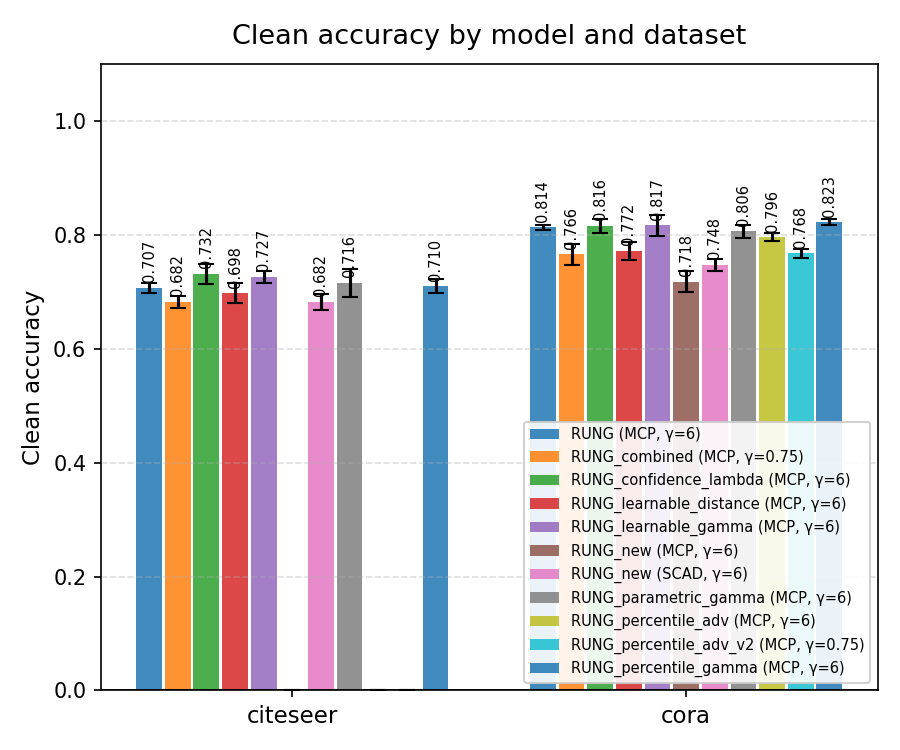
</p>

<p align="center">
  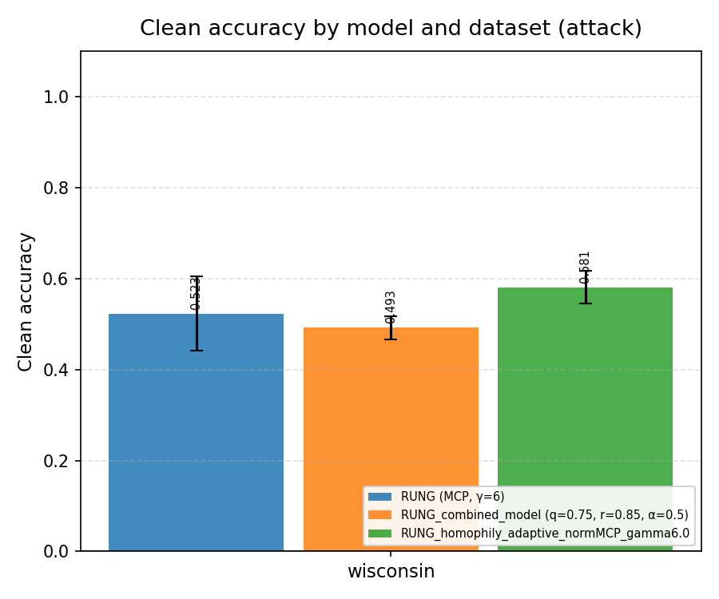
</p>

### Robustness under PGD (all datasets)

<p align="center">
  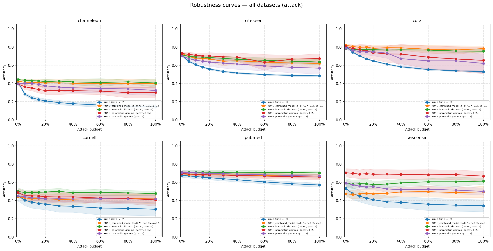
</p>

### Per-dataset robustness curves

| Dataset | Robustness | Multi-model compare |
|---------|------------|---------------------|
| Cora | 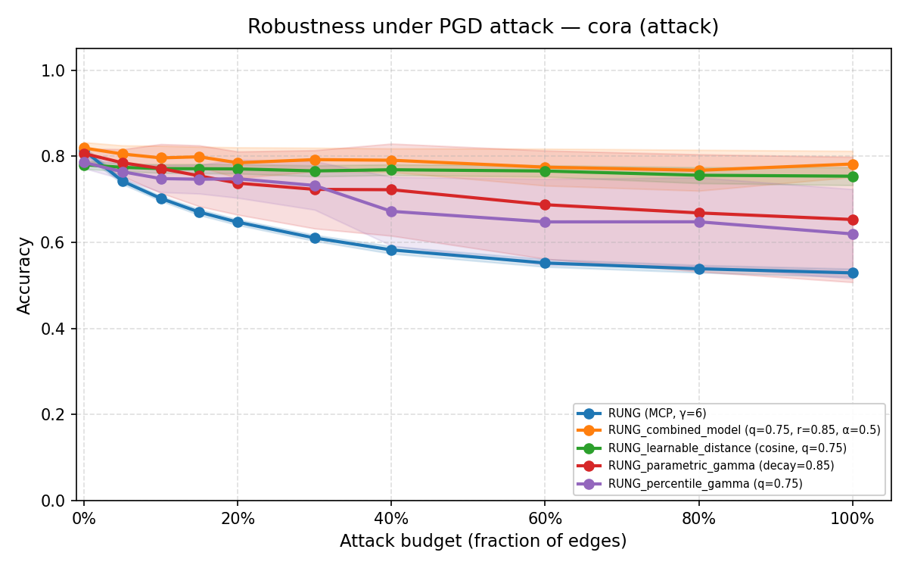 | 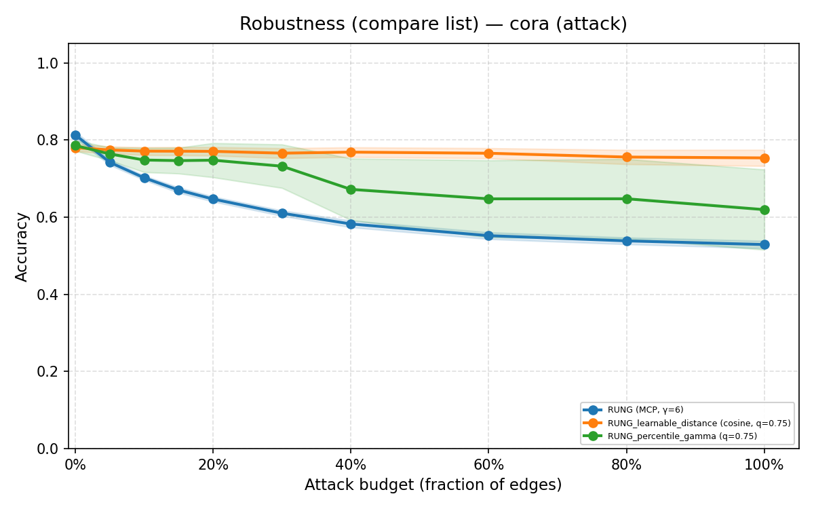 |
| Citeseer | 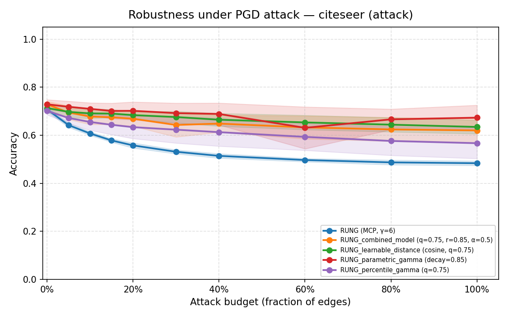 | 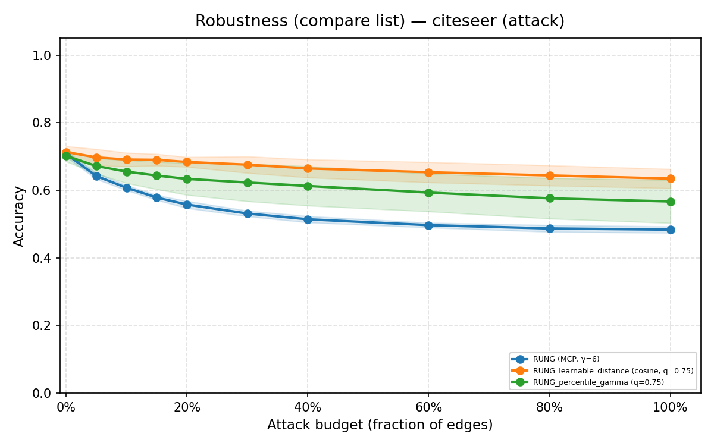 |
| PubMed | 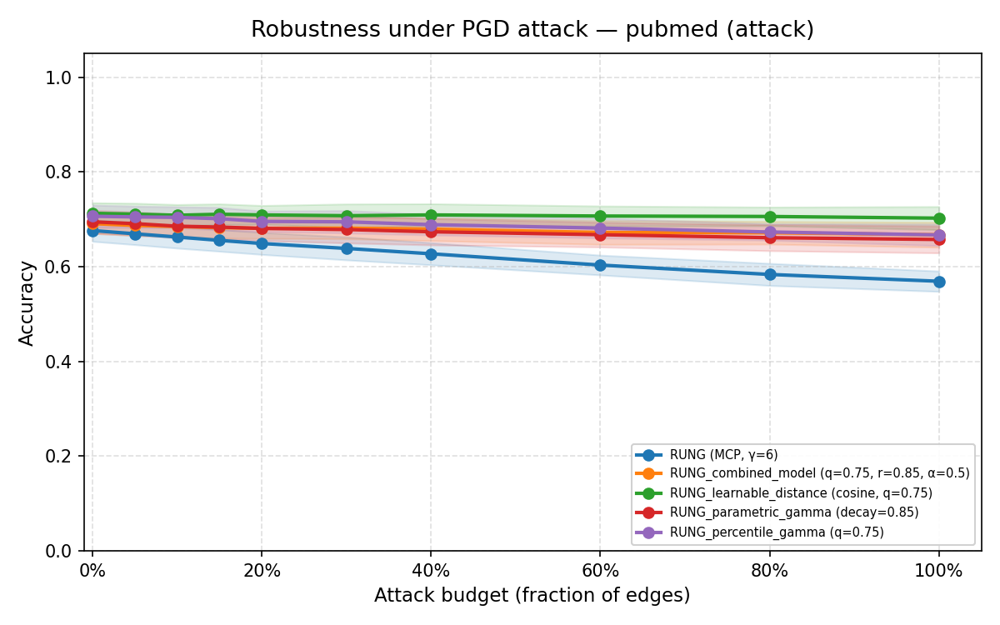 | 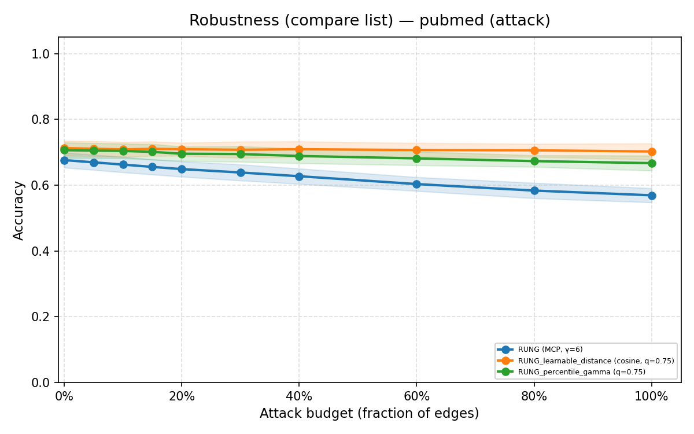 |
| Chameleon | 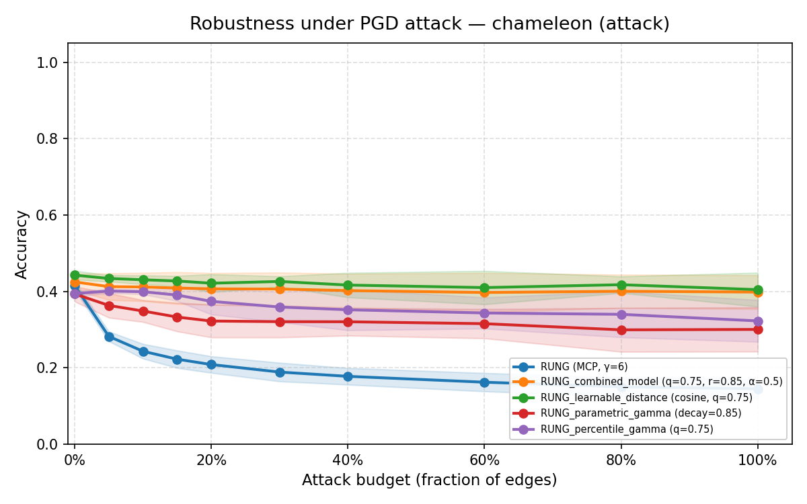 | 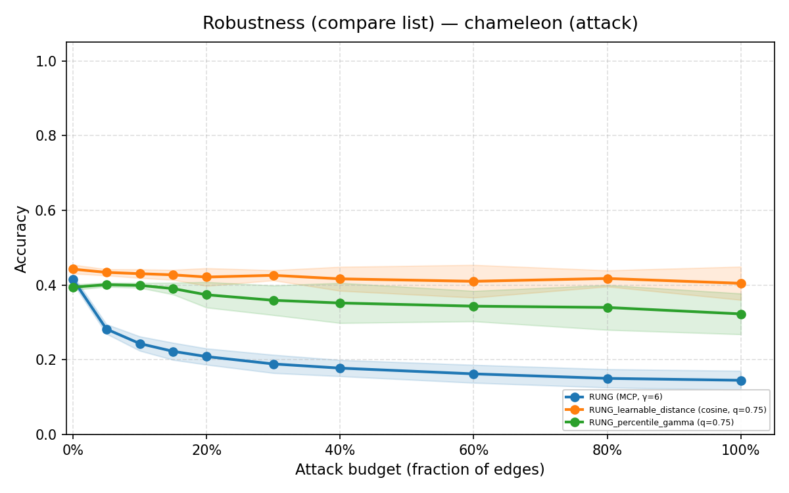 |
| Cornell | 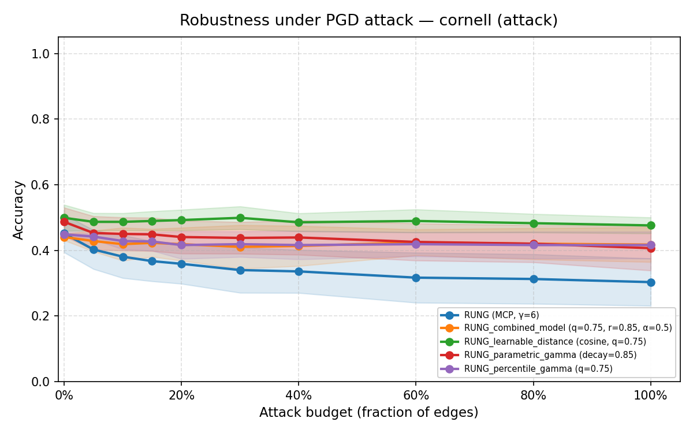 | 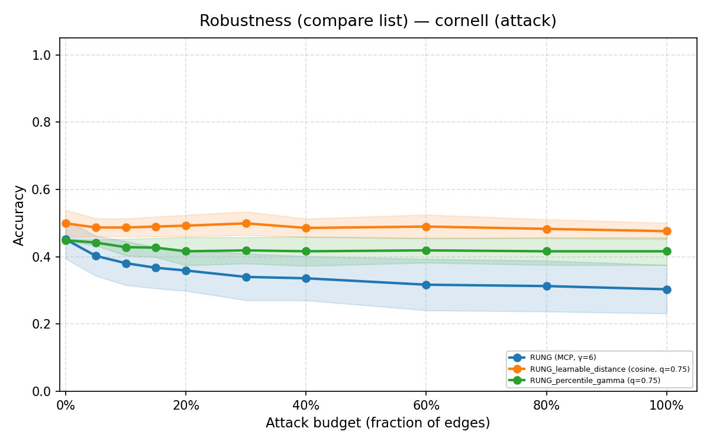 |
| Wisconsin | 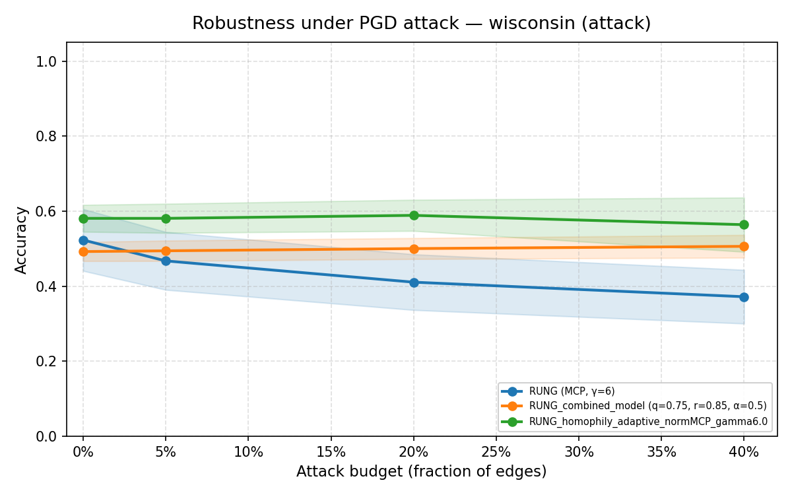 | 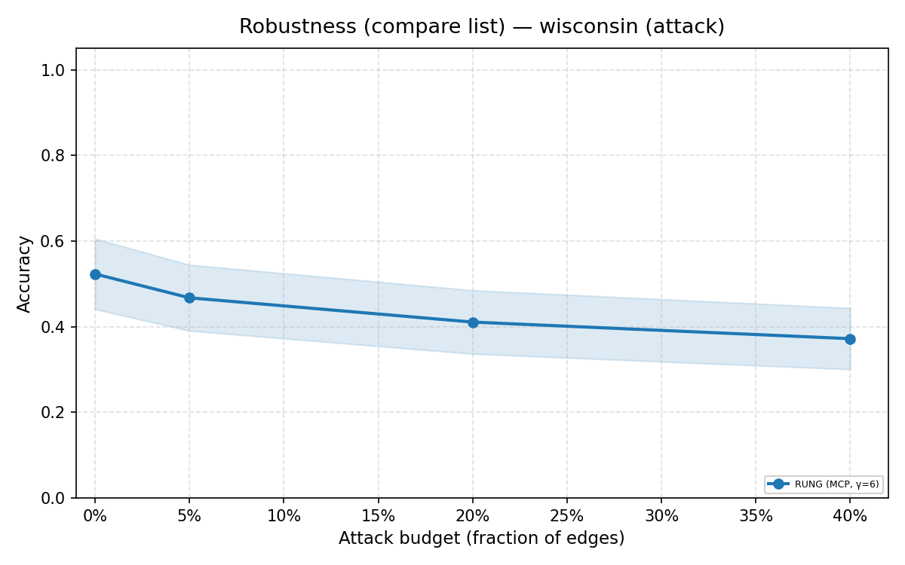 |

### Example numbers (Cora, from `log/`)

| Model | Clean acc (mean ± std) | Notes |
|-------|------------------------|-------|
| RUNG (MCP, γ=6.0) | **0.813 ± 0.009** | Paper baseline |
| RUNG_combined_model (q=0.75, r=0.85, α=0.5) | **0.819 ± 0.013** | Slightly higher clean |
| … under PGD budget 0.05 | Attacked **0.805 ± 0.020** | Combined model |
| … under PGD budget 0.6 | Attacked **0.775 ± 0.043** | Combined model |

Pairwise “baseline vs variant” plots and per-model attack curves live under:

- `figures/attack/robustness_<dataset>_RUNG_MCP_gamma6_vs_*.png`
- `figures/attack_comparison/<dataset>_<model>.png`

Regenerate after new runs:

```bash
python plot_logs.py --log_dir log --out_dir figures --dpi 150
```

---

## Documentation Map

| Location | Contents |
|----------|----------|
| [`docs/changes/`](docs/changes/) | Numbered design notes for each extension (penalty functions, γ schedules, distance, adversarial training, cosine attack, …) |
| [`docs/model_codeflow/`](docs/model_codeflow/) | Source-verified diffs of each variant vs `model/rung.py` |
| [`docs/otherfiles/README.md`](docs/otherfiles/README.md) | Original paper README (install + base clean/attack) |
| [`docs/otherfiles/RUN_ALL_GUIDE.md`](docs/otherfiles/RUN_ALL_GUIDE.md) | Batch experiment guide |
| [`docs/otherfiles/README_RUNG_COMBINED_FINAL.md`](docs/otherfiles/README_RUNG_COMBINED_FINAL.md) | Combined-model deep dive |
| [`docs/otherfiles/README_ADVERSARIAL_V2.md`](docs/otherfiles/README_ADVERSARIAL_V2.md) | Adversarial training V2 |

---

## Citation

If you use the original RUNG method, please cite:

```bibtex
@misc{hou2024robustgraphneuralnetworks,
  title={Robust Graph Neural Networks via Unbiased Aggregation},
  author={Zhichao Hou and Ruiqi Feng and Tyler Derr and Xiaorui Liu},
  year={2024},
  eprint={2311.14934},
  archivePrefix={arXiv},
  primaryClass={cs.LG},
  url={https://arxiv.org/abs/2311.14934}
}
```

This repository extends that work with adaptive γ, learnable distances, combined architectures, heterophily-aware pruning, adversarial training, and cosine-aware evaluation. Please cite the paper above when building on RUNG, and reference this repository for the extension implementations.

---

## License & Acknowledgments

Code and experiments build on the public RUNG codebase associated with Hou et al. (NeurIPS 2024). Graph attack utilities draw on the included `gb/` graph-benchmark components. Datasets are provided by their respective publishers (Planetoid, WikipediaNetwork / WebKB via PyG, OGB).
